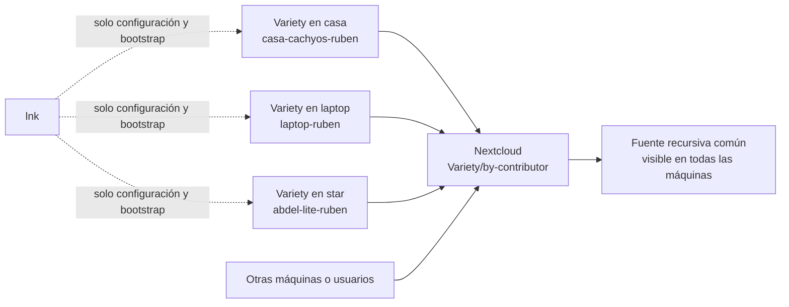

# Sincronizar los favoritos de Variety sin meterlos en Git

> **Recomendación:** usar Nextcloud como transporte de una biblioteca física y aditiva, separar las aportaciones por máquina y usuario, y dejar que `lnk` distribuya únicamente la configuración y un pequeño enlace o script de preparación. No guardar las imágenes en `lnk`, ni volver a sincronizarlas mediante un repositorio Git.

## 1. Qué se está decidiendo

La colección debe cumplir cuatro cosas a la vez: todas las máquinas deben poder leerla, varias máquinas y fuentes deben poder aportar, una incorporación no debe pisar otra por compartir nombre y el crecimiento de los binarios no debe volver lento o inmanejable el repositorio de dotfiles.

La separación propuesta es deliberada:

- **`lnk` conserva la receta:** `variety.conf`, scripts, la declaración de la fuente compartida y, si hace falta, la preparación del enlace local.
- **Nextcloud conserva los datos:** los JPG, PNG, WebP y sus metadatos.
- **Cada máquina escribe en un espacio propio:** evita que dos aportaciones llamadas, por ejemplo, `wallpaper.jpg` compitan por la misma ruta.
- **Todas leen el directorio padre:** Variety admite carpetas recursivas, de modo que la colección común aparece en todas las máquinas después de sincronizar.



### Autorización adicional para compartir la biblioteca

El 11 de agosto de 2026 a las 09:22:43 (UTC-06:00), Rubén autorizó explícitamente compartir `Shared/Wallpapers/Variety` de la cuenta `arqueon` con `abdeluck`, con permisos de lectura, creación y actualización, sin borrado ni re-compartición, y continuar el despliegue únicamente en `abdel-home`. Esta autorización se añadió después de que la compuerta de seguridad detuviera el primer intento; antes de ella no se creó ningún share.

## 2. Evidencia del estado actual

| Evidencia comprobada el 10 de agosto de 2026 | Resultado | Consecuencia |
|---|---:|---|
| Favoritos locales de Variety | 671 archivos; 2.5 GB | Ya es una colección de datos, no una configuración pequeña. |
| Duplicados exactos por SHA-256 | 0 | No hace falta desplegar ahora un deduplicador permanente. |
| Favoritos rastreados en `arqueon-conf` | 658 archivos; 2.45 GiB en el último árbol verificado | El repositorio viejo contenía una copia histórica de casi toda la colección. |
| Comparación exacta repo viejo → colección local | 658 de 658 presentes; 0 faltantes; 0 hashes Git distintos | Los wallpapers del repo viejo ya están íntegros en la colección local de 671 archivos. |
| Tamaño reportado por GitHub para `arqueon-conf` | 5,662,998 KiB, aproximadamente 5.4 GiB | El historial de binarios ya multiplicó el peso efectivo. |
| `lnk` actual | Solo administra `variety.conf`, `banned.txt` y scripts | La separación moderna ya empezó; conviene conservarla. |
| Variety instalado | 0.9.0 | La solución debe funcionar con su comportamiento actual, no depender de una función futura. |

El código instalado de Variety copia el favorito con su **nombre base original** mediante `shutil.copy` y considera que ya existe si encuentra ese mismo nombre en la carpeta de favoritos. Por eso una sola carpeta plana compartida es sencilla, pero no es la opción más robusta cuando varias fuentes y máquinas aportan. El proyecto, además, declara que Variety está en modo de mantenimiento; conviene resolver la sincronización fuera de la aplicación y no esperar una nueva función nativa. [Repositorio oficial de Variety](https://github.com/varietywalls/variety)

## 3. Arquitectura recomendada

Usar una carpeta física —no un enlace dentro del árbol de Nextcloud— con esta forma:

```text
~/Nextcloud/Shared/Wallpapers/Variety/
└── by-contributor/
    ├── casa-cachyos-ruben/
    ├── ruben-laptop-ruben/
    ├── abdel-lite-ruben/
    └── otra-maquina-usuario/
```

En cada cuenta, `~/.config/variety/Favorites` puede ser un enlace **local y externo al árbol sincronizado** que apunte a su subcarpeta `by-contributor/<hostname>-<usuario>`. Nextcloud ve y sincroniza el directorio físico de destino; no se le pide sincronizar el enlace. `lnk` puede distribuir el script idempotente que crea o valida ese enlace, pero no las imágenes.

Todas las instalaciones de Variety reciben además una fuente de tipo `folder` apuntando a:

```text
~/Nextcloud/Shared/Wallpapers/Variety/by-contributor
```

Esa fuente se lee recursivamente. Así, cada escritor tiene su propio espacio y todas las máquinas consumen el conjunto completo.

### Reglas operativas

1. La colección es **aditiva** durante el piloto: agregar sí; borrar o reorganizar globalmente, no.
2. Una máquina solo escribe en su subcarpeta. El identificador incluye host y usuario para cubrir equipos con dos cuentas.
3. Una auditoría periódica puede detectar duplicados por SHA-256 y nombres conflictivos, pero no elimina automáticamente.
4. Las imágenes deben estar disponibles sin conexión en cada máquina que rote fondos; no usar archivos virtuales bajo demanda para esta carpeta.
5. La primera migración conserva metadatos y se verifica por conteo y hashes antes de sustituir la carpeta local.
6. El repositorio viejo solo podía retirarse después de verificar la biblioteca compartida y con autorización separada.

La comprobación de contenido mostró que los 658 wallpapers de `arqueon-conf` estaban presentes **byte por byte** en la colección local actual. Después de sembrar y verificar también la copia remota, se cumplió la compuerta autorizada y el repositorio fue eliminado de GitHub.

Nextcloud crea copias en conflicto cuando la misma ruta cambia local y remotamente entre sincronizaciones. La separación por contribuyente evita precisamente que dos equipos modifiquen la misma ruta. [Documentación oficial sobre conflictos](https://docs.nextcloud.com/server/latest/user_manual/en/desktop/conflicts.html)

## 4. Comparación de alternativas

| Opción | Ventaja principal | Problema en este caso | Dictamen |
|---|---|---|---|
| **Nextcloud con subcarpetas por contribuyente** | Usa infraestructura ya presente, converge aunque una laptop esté apagada y evita colisiones de ruta. | Requiere preparar una ruta local por cuenta y sincronizar 2.5 GB en cada equipo consumidor. | **Recomendada.** |
| Nextcloud con una única carpeta plana | Es la configuración más corta: todas apuntan al mismo `favorites_folder`. | Variety decide por nombre base y puede impedir o pisar aportaciones homónimas. | Aceptable solo si se prioriza simplicidad sobre robustez. |
| Syncthing | Sincronización P2P rápida y carpetas send/receive explícitas. | Añade otro servicio y no aporta una ventaja clara frente al Nextcloud central que ya existe. | Alternativa si alguna máquina no puede usar Nextcloud. |
| Git o Git LFS dentro de `lnk` | Historial y distribución familiar. | Historial creciente, clones pesados, cuotas/transferencias LFS y conflictos que no corresponden a una fototeca mutable. | Descartada. |
| `rsync` periódico entre máquinas | Es sencillo para una fuente y un destino. | No define bien autoridad, conflictos ni borrados cuando hay varios escritores. | Útil solo para la siembra inicial. |

## 5. Piloto reversible ejecutado

La secuencia se ejecutó únicamente en `casa-cachyos`:

1. Pausar Variety y comprobar que Nextcloud está sincronizando sin errores.
2. Respaldar `~/.config/variety/Favorites` sin modificarlo.
3. Crear la carpeta física `by-contributor/casa-cachyos-ruben`.
4. Copiar los 671 favoritos y sus metadatos con una operación que no sobrescriba.
5. Esperar convergencia, verificar conteo y SHA-256.
6. Sustituir la carpeta local por el enlace reversible y añadir la fuente recursiva mediante `lnk`.
7. Probar el alta idempotente de un favorito compartido y restaurar el fondo anterior.

El piloto y la retirada posterior de `arqueon-conf` fueron autorizados y completados. Esto **no** autoriza commit, push ni despliegue al resto de máquinas.

## 6. Decisión y alcance

```form
id: decision-sincronizacion-favoritos-variety
fields:
  - name: decision
    type: radio
    label: Decisión sobre la arquitectura
    help: La primera opción separa datos y configuración y evita colisiones entre equipos.
    required: true
    default: Adoptar Nextcloud con subcarpetas por máquina y usuario (recomendado)
    options: [Adoptar Nextcloud con subcarpetas por máquina y usuario (recomendado), Usar una sola carpeta plana de Nextcloud por simplicidad, Evaluar Syncthing antes de decidir, Conservar solo el análisis y no aplicar cambios]
  - name: siguiente_paso
    type: radio
    label: Siguiente paso autorizado
    required: true
    default: Preparar un piloto reversible solo en casa-cachyos
    options: [Preparar un piloto reversible solo en casa-cachyos, Preparar el plan detallado sin cambiar archivos, Diseñar desde ahora el despliegue para todos los perfiles de lnk, No realizar ninguna acción adicional]
  - name: condiciones
    type: textarea
    label: Condiciones, máquinas incluidas o ajustes
    placeholder: Por ejemplo, qué equipos no tienen Nextcloud o qué cuentas también deben aportar.
    rows: 5
  - name: destino_arqueon_conf
    type: radio
    label: Destino del repositorio arqueon-conf
    help: Los 658 wallpapers del repo ya están íntegros en la colección local; ninguna opción se ejecutará antes de verificar la biblioteca nueva.
    required: true
    default: Eliminar por completo el repositorio remoto después de verificar la biblioteca compartida
    options: [Eliminar por completo el repositorio remoto después de verificar la biblioteca compartida, Archivar el repositorio como solo lectura después de verificar la biblioteca, Conservarlo temporalmente aunque deje de usarse, No realizar ninguna acción sobre el repositorio]
  - name: limites
    type: checkbox
    label: Límites que deben quedar explícitos
    help: Estos límites se aplicarán incluso si se autoriza el piloto.
    default: [No borrar ni reescribir favoritos existentes, No retirar arqueon-conf antes de verificar la biblioteca nueva, No hacer commit ni push en lnk, No desplegar a otras máquinas sin una segunda autorización]
    options: [No borrar ni reescribir favoritos existentes, No retirar arqueon-conf antes de verificar la biblioteca nueva, No hacer commit ni push en lnk, No desplegar a otras máquinas sin una segunda autorización]
buttons:
  - name: enviar_decision
    label: Enviar decisión sobre la sincronización
    final: true
answers:
  decision: Adoptar Nextcloud con subcarpetas por máquina y usuario (recomendado)
  siguiente_paso: Preparar un piloto reversible solo en casa-cachyos
  condiciones: |
    ¿Cómo se configurarían los demás equipos sin que sea eso demasiado manual?
    
    Equipos previstos: casa-cachyos, abdel-home, abdel-lite, cachyos-jc,
    cachyos-ofi y ruben-laptop; todos pertenecen a la misma tailnet.
  destino_arqueon_conf: Eliminar por completo el repositorio remoto después de verificar la biblioteca compartida
  limites: [No borrar ni reescribir favoritos existentes, No retirar arqueon-conf antes de verificar la biblioteca nueva, No hacer commit ni push en lnk, No desplegar a otras máquinas sin una segunda autorización]
submissions:
  - by: chat_recovery_after_stalled_feedback
    at: "2026-08-10T22:30:21-06:00"
    scope: [decision, siguiente_paso, condiciones, destino_arqueon_conf, limites]
    values:
      decision: Adoptar Nextcloud con subcarpetas por máquina y usuario (recomendado)
      siguiente_paso: Preparar un piloto reversible solo en casa-cachyos
      condiciones: |
        ¿Cómo se configurarían los demás equipos sin que sea eso demasiado manual?
        
        Equipos previstos: casa-cachyos, abdel-home, abdel-lite, cachyos-jc,
        cachyos-ofi y ruben-laptop; todos pertenecen a la misma tailnet.
      destino_arqueon_conf: Eliminar por completo el repositorio remoto después de verificar la biblioteca compartida
      limites: [No borrar ni reescribir favoritos existentes, No retirar arqueon-conf antes de verificar la biblioteca nueva, No hacer commit ni push en lnk, No desplegar a otras máquinas sin una segunda autorización]
  - by: enviar_decision
    at: "2026-08-11T04:53:57.168Z"
    scope: [decision, siguiente_paso, condiciones, destino_arqueon_conf, limites]
    values:
      decision: Adoptar Nextcloud con subcarpetas por máquina y usuario (recomendado)
      siguiente_paso: Preparar un piloto reversible solo en casa-cachyos
      condiciones: |
        ¿Cómo se configurarían los demás equipos sin que sea eso demasiado manual?
        
        Equipos previstos: casa-cachyos, abdel-home, abdel-lite, cachyos-jc,
        cachyos-ofi y ruben-laptop; todos pertenecen a la misma tailnet.
      destino_arqueon_conf: Eliminar por completo el repositorio remoto después de verificar la biblioteca compartida
      limites: [No borrar ni reescribir favoritos existentes, No retirar arqueon-conf antes de verificar la biblioteca nueva, No hacer commit ni push en lnk, No desplegar a otras máquinas sin una segunda autorización]
  - by: enviar_decision
    at: "2026-08-11T14:58:19.087Z"
    scope: [decision, siguiente_paso, condiciones, destino_arqueon_conf, limites]
    values:
      decision: Adoptar Nextcloud con subcarpetas por máquina y usuario (recomendado)
      siguiente_paso: Preparar un piloto reversible solo en casa-cachyos
      condiciones: |
        ¿Cómo se configurarían los demás equipos sin que sea eso demasiado manual?
        
        Equipos previstos: casa-cachyos, abdel-home, abdel-lite, cachyos-jc,
        cachyos-ofi y ruben-laptop; todos pertenecen a la misma tailnet.
      destino_arqueon_conf: Eliminar por completo el repositorio remoto después de verificar la biblioteca compartida
      limites: [No borrar ni reescribir favoritos existentes, No retirar arqueon-conf antes de verificar la biblioteca nueva, No hacer commit ni push en lnk, No desplegar a otras máquinas sin una segunda autorización]
```

## 7. Resultado aplicado y verificado

La interfaz quedó en `Sending...` porque el escuchador del primer formulario ya había terminado. La decisión se recuperó del mensaje y la captura de Rubén, y quedó persistida arriba como `chat_recovery_after_stalled_feedback`; no se trató el valor predeterminado como decisión silenciosa.

El piloto autorizado en `casa-cachyos` terminó correctamente:

| Control | Resultado |
|---|---|
| Biblioteca local | 671 archivos; 2,681,756,020 bytes. |
| Ruta contribuyente | `~/Nextcloud/Shared/Wallpapers/Variety/by-contributor/casa-cachyos-ruben` |
| Respaldo reversible | `~/.local/state/variety-favorites-sync/Favorites-before-shared-20260810-223342` |
| Original frente a biblioteca | Coincidencia completa por checksum, nombre, tamaño y conteo. |
| Nextcloud Desktop | `Connected - Success`. |
| Verificación WebDAV independiente | 671 archivos coincidentes y 0 diferencias por nombre+tamaño. |
| Variety | Activo, cambios automáticos reanudados y fuente recursiva común cargada en el log. |
| Atajo `Mod+Alt+F` | No vuelve a copiar una imagen ya compartida; resuelve colisiones de nombre con sufijo de contenido. |
| GitHub | `arqueon/arqueon-conf` eliminado después de verificar la biblioteca; la API confirmó `404 Not Found`. |

El rollback local conserva la copia compartida y restaura la carpeta original:

```bash
variety --quit
variety-favorites-bootstrap rollback
```

## 8. Cómo se incorporarán los otros equipos sin configuración manual

`lnk` publica dos helpers comunes; la mejora de deduplicación quedó en `main` con el commit `9ab8834`:

- `variety-favorites-bootstrap`: detecta `hostname + usuario`, comprueba que exista una raíz Nextcloud realmente sincronizada, copia sin sobrescribir, verifica por checksum, crea el enlace y conserva rollback.
- `variety-favorite-shared`: incorpora un favorito de forma atómica, detecta por contenido si ya existe y evita duplicar imágenes recibidas de otra máquina.

La relación prevista entre nodos y perfiles es:

| Nodo Tailscale | Perfil `lnk` | Carpeta que se calcula automáticamente | Estado |
|---|---|---|---|
| `casa-cachyos` | `casa` | `casa-cachyos-<usuario-local>` | Piloto verificado como `casa-cachyos-ruben`. |
| `abdel-home` | `abdel` | `abdel-home-<usuario-local>` | Desplegado y verificado como `abdel-home-abdel`. |
| `abdel-lite` | `star` | `abdel-lite-<usuario-local>` | Pendiente de segunda autorización. |
| `cachyos-jc` | `jc` | `cachyos-jc-<usuario-local>` | Pendiente de segunda autorización. |
| `cachyos-ofi` | `ofi` | `cachyos-ofi-<usuario-local>` | Pendiente de segunda autorización. |
| `ruben-laptop` | `laptop` | `ruben-laptop-<usuario-local>` | Pendiente de segunda autorización. |

Todos los nodos previstos usan Arch Linux o CachyOS. Por tanto, el preflight puede comprobar e instalar de manera uniforme el paquete `nextcloud-client` con `pacman`; no hace falta mantener ramas distintas por distribución.

Tras un VoBo separado para la flota, el agente hará por Tailscale/SSH: comprobar usuario, espacio y Nextcloud; ejecutar `lnk pull --host <perfil>`; cerrar Variety; correr `variety-favorites-bootstrap apply`; reiniciar y verificar WebDAV. En equipos todavía no configurados se usará `~/Nextcloud` como ruta convencional. Antes de sincronizar se comprobará la capacidad: si la partición raíz no tiene margen suficiente, el cliente se configurará directamente sobre una partición con espacio y `~/Nextcloud` será un enlace local hacia esa ruta real. No se descargará primero la biblioteca en una partición saturada para moverla después.

Crear solamente un directorio vacío `~/Nextcloud` no lo convierte en una raíz válida: el helper exige también la base de sincronización del cliente y aborta sin modificar `Favorites` si no la encuentra. La única intervención manual inevitable sería autenticar Nextcloud una vez en un equipo que todavía no tenga cuenta configurada.

Los cambios comunes de `lnk` fueron publicados después del VoBo específico para `abdel-home`. Ninguno de los otros cuatro nodos pendientes fue contactado o modificado.

## 9. Preflight remoto de `abdel-home`

El 11 de agosto de 2026 `abdel-home` reapareció en Tailscale y se auditó por SSH como `abdel`, sin modificarlo.

| Control | Resultado |
|---|---|
| Sistema | Arch Linux; `nextcloud-client` 34.0.1 y Variety 0.9.0 instalados. |
| Nextcloud real | Configurado y con base de sincronización en `/media/hrdisk/Nextcloud/`. |
| Compatibilidad `~/Nextcloud` | Existe como directorio vacío; todavía no es un enlace a la raíz real. |
| Almacenamiento | 380 GB libres en `/media/hrdisk`; 347 GB libres en `/home`. |
| Biblioteca compartida | Aún no está descargada en la raíz real; el cliente Nextcloud no estaba ejecutándose durante el preflight. |
| Favoritos locales | 609 archivos; 2,330,962,198 bytes. |
| `lnk` remoto | Tiene un cambio local ajeno en `.config/niri/dms/windowrules.kdl`; debe preservarse. |

### Secuencia propuesta

1. Fortalecer localmente `variety-favorites-bootstrap` para importar solo contenidos que no existan ya en toda la biblioteca y verificar cada favorito original por contenido.
2. Probar apply, verificación y rollback con colecciones solapadas y colisiones de nombre.
3. Conservar como respaldo el directorio vacío `~/Nextcloud` y crear el enlace `~/Nextcloud → /media/hrdisk/Nextcloud`.
4. Arrancar Nextcloud en la sesión de `abdel`, esperar la biblioteca compartida y verificar su convergencia antes de tocar Variety.
5. Hacer commit/push de los cambios comunes de `lnk`, preservando tanto los cambios locales de esta máquina como el cambio remoto de `windowrules.kdl`.
6. Ejecutar `lnk pull --host abdel`, detener Variety, aplicar el bootstrap deduplicado y verificar respaldo, enlace, biblioteca y WebDAV.
7. Reiniciar Variety en su sesión gráfica. No pasar a otro host en esta compuerta.

```form
id: decision-despliegue-variety-abdel-home
fields:
  - name: decision_abdel_home
    type: radio
    label: Alcance autorizado para abdel-home
    required: true
    default: Preparar y desplegar Variety solo en abdel-home (recomendado)
    options:
      - Preparar y desplegar Variety solo en abdel-home (recomendado)
      - Preparar únicamente Nextcloud y detenerse antes de lnk y Variety
      - Conservar solo el preflight sin aplicar cambios

  - name: publicacion_lnk
    type: radio
    label: Publicación inicial de lnk
    required: true
    default: Autorizar commit y push de la configuración y helpers de Variety
    options:
      - Autorizar commit y push de la configuración y helpers de Variety
      - Mantener lnk sin publicar y detener el despliegue

  - name: limites_abdel_home
    type: checkbox
    label: Límites de la intervención
    options:
      - Preservar los 609 favoritos originales y mantener rollback
      - No tocar el cambio remoto de windowrules.kdl
      - No desplegar ningún otro host
      - Detenerse si Nextcloud presenta conflicto, error de cuenta o sincronización incompleta
    default:
      - Preservar los 609 favoritos originales y mantener rollback
      - No tocar el cambio remoto de windowrules.kdl
      - No desplegar ningún otro host
      - Detenerse si Nextcloud presenta conflicto, error de cuenta o sincronización incompleta

  - name: observaciones_abdel_home
    type: textarea
    label: Condiciones u observaciones opcionales
    rows: 3

buttons:
  - name: enviar_autorizacion_abdel_home
    label: Enviar decisión para abdel-home
    final: true
answers:
  decision_abdel_home: Preparar y desplegar Variety solo en abdel-home (recomendado)
  publicacion_lnk: Autorizar commit y push de la configuración y helpers de Variety
  limites_abdel_home:
    - Preservar los 609 favoritos originales y mantener rollback
    - No tocar el cambio remoto de windowrules.kdl
    - No desplegar ningún otro host
    - Detenerse si Nextcloud presenta conflicto, error de cuenta o sincronización incompleta
  observaciones_abdel_home: Autorizado en chat; implementar en abdel-home y sincronizar lnk.
submissions:
  - by: chat_authorization_after_wrong_form_submission
    at: "2026-08-11T09:00:27-06:00"
    scope: [decision_abdel_home, publicacion_lnk, limites_abdel_home, observaciones_abdel_home]
    values:
      decision_abdel_home: Preparar y desplegar Variety solo en abdel-home (recomendado)
      publicacion_lnk: Autorizar commit y push de la configuración y helpers de Variety
      limites_abdel_home:
        - Preservar los 609 favoritos originales y mantener rollback
        - No tocar el cambio remoto de windowrules.kdl
        - No desplegar ningún otro host
        - Detenerse si Nextcloud presenta conflicto, error de cuenta o sincronización incompleta
      observaciones_abdel_home: Autorizado en chat; implementar en abdel-home y sincronizar lnk.
```

## 10. Despliegue verificado en `abdel-home`

El despliegue autorizado terminó sin extenderse a otro host:

| Control | Resultado |
|---|---|
| Share de Nextcloud | `Shared/Wallpapers/Variety`, de `arqueon` a `abdeluck`, con lectura, creación y actualización; sin borrado ni re-compartición. |
| Raíz compatible | `~/Nextcloud` enlaza a `/media/hrdisk/Nextcloud`. |
| Favoritos de Variety | `~/.config/variety/Favorites` enlaza a `by-contributor/abdel-home-abdel`. |
| Respaldo reversible | `~/.local/state/variety-favorites-sync/Favorites-before-shared-20260811-093008`. |
| Configuración de fuentes | La fuente nativa `favorites` está desactivada y la carpeta recursiva común `by-contributor` está activada. |
| Proceso | Nextcloud y Variety están ejecutándose en la sesión de `abdel`. |
| Aportes propios | 2 archivos en `abdel-home-abdel`; los 609 favoritos originales quedaron representados por contenido en la biblioteca compartida. |
| Convergencia final | Biblioteca local de `abdel-home` y WebDAV del propietario: 673 archivos y 2,690,346,323 bytes en ambos lados. |
| `lnk` | Helpers deduplicados publicados en `main` (`9ab8834`); el cambio ajeno en `windowrules.kdl` se conservó fuera del despliegue. |

Los nodos `abdel-lite`, `cachyos-jc`, `cachyos-ofi` y `ruben-laptop` permanecen pendientes de una autorización separada.
